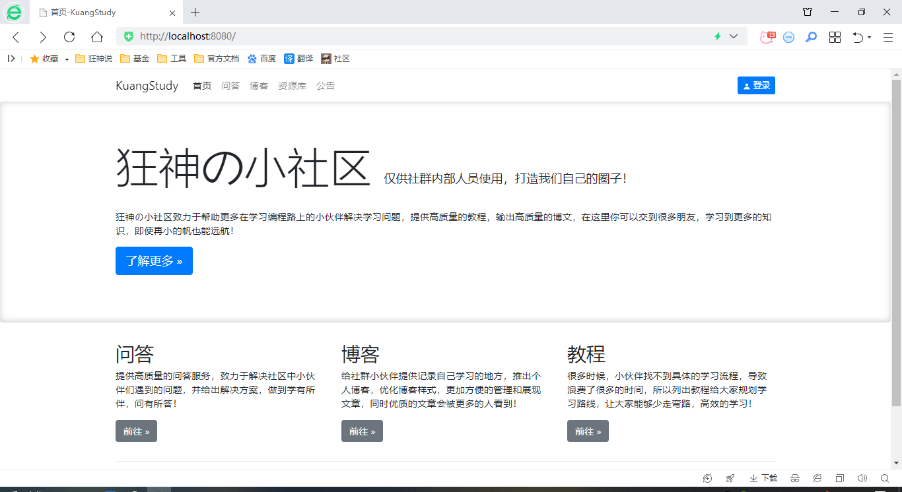

# 狂神的小社区开源版



### 介绍

> 社区开源版本，精简了代码，改变为单体项目，方便大家一键启动！

> 地址：http://www.kuangstudy.com/ 

项目架子主要依赖：
- SpringBoot 2.3.0
- MySQL 5.7
- MyBatisPlus 3.0.5
- swagger
- fastjson
- thymeleaf
- editormd
- layer
- bootstrap
- springsecurity
- 代码自动生成

### 安装教程

1.  执行SQL，创建数据库
2.  项目导入IDEA 启动
3.  访问测试！
4.  自行根据代码逻辑填充测试数据，查看即可！

### 目录说明
```shell script
src/main/java/com/kuang
- config        配置类
- controller    controller
- generator     代码生成器
- mapper        mapper
- pojo          pojo
- result        统一返回结果
- service       service
- utils         工具类
- vo            vo对象
KuangstudyApplication   启动类

src/resources
- static        静态资源
- templates     页面模板
- application-dev.properties   配置文件

kuangshen.sql   数据库文件
```

### 如何加入狂神的小社区

http://mp.weixin.qq.com/mp/homepage?__biz=Mzg2NTAzMTExNg==&hid=5&sn=5732bda552bcb476e55f678983edfb51&scene=18#wechat_redirect

